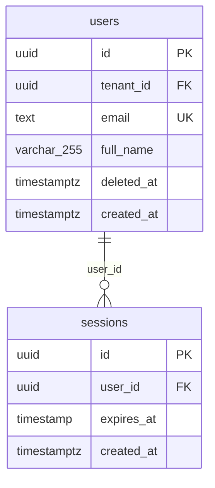

# Authentication & identity

Who can log in and how: users and their sessions.

Tenant-scoped: yes

## users

Portal users. Soft-deleted.

| Column | Type | Null | Default | References | Notes |
|---|---|---|---|---|---|
| `id` (PK) | uuid | NOT NULL | gen_random_uuid() |  |  |
| `tenant_id` | uuid | NOT NULL |  | tenant.id |  |
| `email` (UK) | text | NOT NULL |  |  |  |
| `full_name` | varchar(255) |  |  |  |  |
| `deleted_at` | timestamptz |  |  |  |  |
| `created_at` | timestamptz | NOT NULL | now() |  |  |

Indexes: (tenant_id)  
Referenced by: sessions, user_role, github_app_config, approval_request, approval_request  
RLS: enabled, policies: users_tenant_isolation

Findings:

- **Warning** Soft delete collides with non-partial UNIQUE — `users` soft-deletes via `deleted_at`, but `(email)` is unique across live AND deleted rows. A user who deletes their account can never sign up again with the same value, and `ON CONFLICT` upserts will resurrect ghosts.
- **Note** Hub table: referenced by 5 tables — Any change to its key, its delete semantics, or its partitioning touches every dependent. Migrations on hub tables need the longest lock windows and the most careful rollout.

## sessions

| Column | Type | Null | Default | References | Notes |
|---|---|---|---|---|---|
| `id` (PK) | uuid | NOT NULL | gen_random_uuid() |  |  |
| `user_id` | uuid | NOT NULL |  | users.id |  |
| `expires_at` | timestamp | NOT NULL |  |  |  |
| `created_at` | timestamptz | NOT NULL | now() |  |  |

Indexes: none  
Referenced by: nothing  
RLS: off

Findings:

- **Warning** Foreign key without index — PostgreSQL does not index FK columns automatically. Every DELETE/UPDATE on `users` must scan `sessions` to check the constraint, and every join from the parent side is a sequential scan.
- **Note** TIMESTAMP without time zone — `expires_at` stores wall-clock time with no zone. It reads back differently depending on the session's TimeZone, and DST transitions produce ambiguous values.
- **Warning** No `tenant_id`; tenant only reachable via 2 join(s) — `sessions` belongs to a tenant only transitively (sessions → users → tenant). Row-level security, per-tenant export/erasure, and per-tenant sharding all need that join. It works at 10 tenants and hurts at 1,000.

