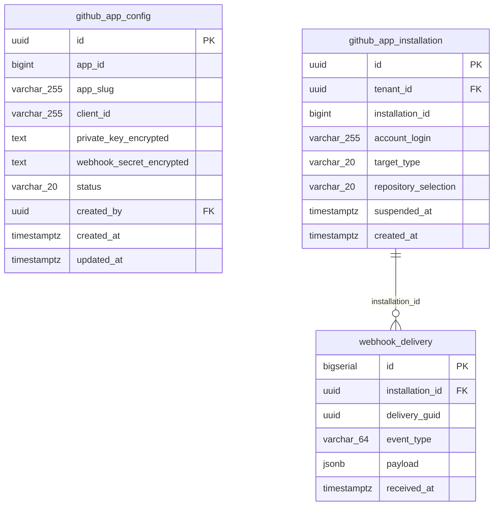

# GitHub integration

One provider-level GitHub App serves the whole portal; tenants map to it via installations, and webhook deliveries are stored raw per installation.

Tenant-scoped: yes

## github_app_config

Provider-level single-row App config. NOT tenant-scoped.

| Column | Type | Null | Default | References | Notes |
|---|---|---|---|---|---|
| `id` (PK) | uuid | NOT NULL | gen_random_uuid() |  |  |
| `app_id` | bigint |  |  |  |  |
| `app_slug` | varchar(255) |  |  |  |  |
| `client_id` | varchar(255) |  |  |  |  |
| `private_key_encrypted` | text |  |  |  | AES-256-GCM via EncryptionService |
| `webhook_secret_encrypted` | text |  |  |  |  |
| `status` | varchar(20) | NOT NULL | 'active' |  |  |
| `created_by` | uuid |  |  | users.id |  |
| `created_at` | timestamptz | NOT NULL | now() |  |  |
| `updated_at` | timestamptz | NOT NULL | now() |  |  |

Indexes: none  
Referenced by: nothing  
RLS: off

Findings:

- **Warning** Foreign key without index — PostgreSQL does not index FK columns automatically. Every DELETE/UPDATE on `users` must scan `github_app_config` to check the constraint, and every join from the parent side is a sequential scan.
- **Note** Nullable foreign key — `github_app_config.created_by` may be NULL, so the relationship to `users` is optional. That is legitimate (e.g. approved_by before approval) but often a modelling shrug: a row with no owner, or two nullable FKs that are secretly an either/or.
- **Warning** Enum-like column with no CHECK — `status` is a short string that clearly takes a fixed set of values, but the database accepts anything. Typos become new states, and nobody can list the legal values without reading application code.
- **Note** Single-row configuration table — `github_app_config` is documented as holding exactly one row. Nothing enforces that (no unique constraint besides the PK), and the day a second instance is needed (a second GitHub App, a staging vs prod config) every reader that does `SELECT * ... LIMIT 1` becomes wrong.

## github_app_installation

Per-tenant installation mapping (tenant -> GitHub App installation).

| Column | Type | Null | Default | References | Notes |
|---|---|---|---|---|---|
| `id` (PK) | uuid | NOT NULL | gen_random_uuid() |  |  |
| `tenant_id` | uuid | NOT NULL |  | tenant.id |  |
| `installation_id` | bigint | NOT NULL |  |  |  |
| `account_login` | varchar(255) |  |  |  |  |
| `target_type` | varchar(20) |  |  |  | Organization \| User |
| `repository_selection` | varchar(20) |  |  |  | all \| selected |
| `suspended_at` | timestamptz |  |  |  |  |
| `created_at` | timestamptz | NOT NULL | now() |  |  |

Indexes: (tenant_id)  
Referenced by: webhook_delivery  
RLS: enabled, policies: github_app_installation_tenant_isolation

Findings:

- **Error** Asserted natural key is not enforced — `(tenant_id, installation_id)` is declared to identify a `github_app_installation` row, but nothing enforces it. Retries, double-submits and webhook redeliveries create duplicates.
- **Warning** Enum-like column with no CHECK — `target_type` is a short string that clearly takes a fixed set of values, but the database accepts anything. Typos become new states, and nobody can list the legal values without reading application code. The comment lists `Organization | User`, i.e. the values are known.
- **Warning** Enum-like column with no CHECK — `repository_selection` is a short string that clearly takes a fixed set of values, but the database accepts anything. Typos become new states, and nobody can list the legal values without reading application code. The comment lists `all | selected`, i.e. the values are known.

## webhook_delivery

Raw webhook deliveries. No tenant_id — tenant is reachable via installation.

| Column | Type | Null | Default | References | Notes |
|---|---|---|---|---|---|
| `id` (PK) | bigserial | NOT NULL |  |  |  |
| `installation_id` | uuid | NOT NULL |  | github_app_installation.id |  |
| `delivery_guid` | uuid | NOT NULL |  |  |  |
| `event_type` | varchar(64) | NOT NULL |  |  |  |
| `payload` | jsonb | NOT NULL |  |  |  |
| `received_at` | timestamptz | NOT NULL | now() |  |  |

Indexes: none  
Referenced by: nothing  
RLS: off

Findings:

- **Warning** Foreign key without index — PostgreSQL does not index FK columns automatically. Every DELETE/UPDATE on `github_app_installation` must scan `webhook_delivery` to check the constraint, and every join from the parent side is a sequential scan.
- **Error** Asserted natural key is not enforced — `(delivery_guid)` is declared to identify a `webhook_delivery` row, but nothing enforces it. Retries, double-submits and webhook redeliveries create duplicates.
- **Warning** No `tenant_id`; tenant only reachable via 2 join(s) — `webhook_delivery` belongs to a tenant only transitively (webhook_delivery → github_app_installation → tenant). Row-level security, per-tenant export/erasure, and per-tenant sharding all need that join. It works at 10 tenants and hurts at 1,000.

