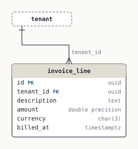

# Billing

Invoice lines per tenant.

Tenant-scoped: yes

## Relationships

- `invoice_line.tenant_id` → `tenant.id` — one tenant, many invoice_line · required · ON DELETE NO ACTION · indexed  
  why: not documented

## invoice_line

| Column | Type | Null | Default | References | Notes |
|---|---|---|---|---|---|
| `id` (PK) | uuid | NOT NULL | gen_random_uuid() |  |  |
| `tenant_id` | uuid | NOT NULL |  | tenant.id |  |
| `description` | text | NOT NULL |  |  |  |
| `amount` | double precision | NOT NULL |  |  |  |
| `currency` | char(3) | NOT NULL | 'CHF' |  |  |
| `billed_at` | timestamptz | NOT NULL | now() |  |  |

Indexes: (tenant_id)  
Referenced by: nothing  
RLS: off

Findings:

- **Note** Tenant FK relies on the default ON DELETE NO ACTION — Deleting a `tenant` row will fail while `invoice_line` rows exist. Fine if tenants are never hard-deleted; a surprise the day offboarding/GDPR erasure is built.
- **Error** Monetary value stored as float — `amount` is binary floating point. 0.1 + 0.2 ≠ 0.3; sums drift; reconciliation against the ledger will be off by cents.
- **Error** Tenant table without row-level security — `invoice_line` carries `tenant_id` but RLS is not enabled, so isolation depends entirely on every query remembering the WHERE clause. One forgotten filter is a cross-tenant leak.

