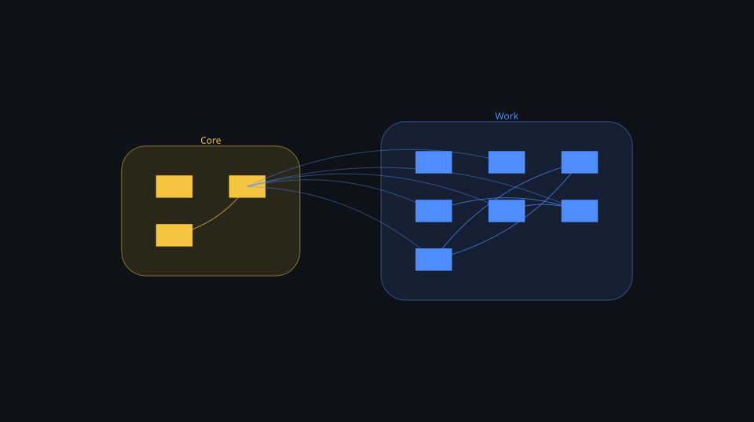

# Edge cases

Every construct the sample schema lacks, so the port is exercised on real parser output.

10 tables · 76 columns · 10 foreign keys · 9 errors · 8 warnings · 11 notes

See [FINDINGS.md](FINDINGS.md) for the design review.

## Conventions

- The tenant column is org_id.

## Domains

| Domain | Tables | Findings |
|---|---|---|
| [Core](domains/core.md) | 4 | 4 |
| [Work](domains/work.md) | 7 | 23 |

## Diagram

The map is the 3D explorer seen from above: one island per domain, one curve per foreign key. Click it to open [schema-3d.html](schema-3d.html) and rotate, zoom, click any table or relationship. The flat entity-relationship diagram is [erd.svg](erd.svg).
