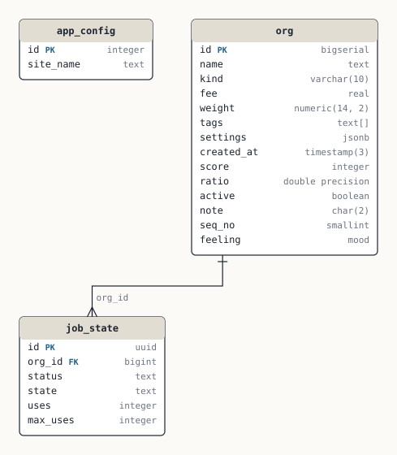

# Core

Organisations, and a table the narrative still lists but the schema dropped.

Tenant-scoped: no

## Relationships

- `job_state.org_id` → `org.id` — one org, many job_state · required · ON DELETE CASCADE · indexed  
  why: jobs run on behalf of one organisation

## org

| Column | Type | Null | Default | References | Notes |
|---|---|---|---|---|---|
| `id` (PK) | bigserial | NOT NULL |  |  |  |
| `name` | text | NOT NULL |  |  |  |
| `kind` | varchar(10) | NOT NULL | 'std' |  | CHECK present: no enum finding |
| `fee` | real |  |  |  | money as float (REAL branch) |
| `weight` | numeric(14, 2) | NOT NULL | 0 |  | zero default is omitted from the tree |
| `tags` | text[] | NOT NULL | ARRAY['a', 'b'] |  |  |
| `settings` | jsonb | NOT NULL | CAST('{}' AS jsonb) |  |  |
| `created_at` | timestamp(3) | NOT NULL | CURRENT_TIMESTAMP |  |  |
| `score` | integer | NOT NULL | -1 |  |  |
| `ratio` | double precision |  | 1.5 |  |  |
| `active` | boolean | NOT NULL | TRUE |  |  |
| `note` | char(2) |  | NULL |  |  |
| `seq_no` | smallint | NOT NULL | nextval('org_seq') |  |  |
| `feeling` | mood |  |  |  |  |

Indexes: none  
Referenced by: widget, attachment, ticket, profile, region, job_state  
RLS: off

Findings:

- **Note** TIMESTAMP without time zone — `created_at` stores wall-clock time with no zone. It reads back differently depending on the session's TimeZone, and DST transitions produce ambiguous values.
- **Error** Monetary value stored as float — `fee` is binary floating point. 0.1 + 0.2 ≠ 0.3; sums drift; reconciliation against the ledger will be off by cents.
- **Note** Hub table: referenced by 6 tables — Any change to its key, its delete semantics, or its partitioning touches every dependent. Migrations on hub tables need the longest lock windows and the most careful rollout.

## ghost_table

_Listed in narratives but missing from the schema._

## job_state

Table-level CHECKs, the only way pg_dump writes them: both enum-ish columns are guarded, so neither may raise undocumented-enum; the two-column CHECK stays on the table.

| Column | Type | Null | Default | References | Notes |
|---|---|---|---|---|---|
| `id` (PK) | uuid | NOT NULL | gen_random_uuid() |  |  |
| `org_id` | bigint | NOT NULL |  | org.id |  |
| `status` | text | NOT NULL |  |  |  |
| `state` | text | NOT NULL |  |  |  |
| `uses` | integer | NOT NULL | 0 |  |  |
| `max_uses` | integer | NOT NULL | 1 |  |  |

Indexes: (org_id)  
Referenced by: nothing  
RLS: off

## app_config

One row, enforced as pg_dump shows it (primary key plus CHECK (id = 1)). Asserted as a singleton in the narratives; must raise no singleton-table finding, unlike profile.

| Column | Type | Null | Default | References | Notes |
|---|---|---|---|---|---|
| `id` (PK) | integer | NOT NULL | 1 |  |  |
| `site_name` | text | NOT NULL |  |  |  |

Indexes: none  
Referenced by: nothing  
RLS: off

Findings:

- **Note** Isolated table — `app_config` references nothing and nothing references it. Either it is a staging/log table (fine, say so), or it is dead, or it is the seed of a second data model growing beside the first.

