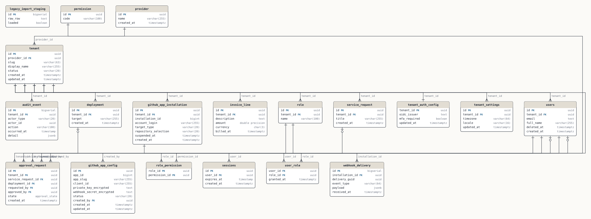

# Portal database

Multi-tenant self-service portal. Provider → Tenant hierarchy; every tenant-scoped table carries tenant_id and is protected by row-level security.

19 tables · 95 columns · 22 foreign keys · 8 errors · 18 warnings · 12 notes

See [FINDINGS.md](FINDINGS.md) for the design review.

## Conventions

- Primary keys are UUID v4 (gen_random_uuid()) except append-only logs, which use BIGSERIAL.
- Every tenant-scoped table has a tenant_id column and an RLS policy keyed on app.tenant_id.
- Timestamps are TIMESTAMPTZ.
- Enum-like columns carry a CHECK constraint or use a PostgreSQL ENUM type.
- Soft delete uses deleted_at; uniqueness on soft-deleted tables must be partial (WHERE deleted_at IS NULL).

## Domains

| Domain | Tables | Findings |
|---|---|---|
| [Multi-tenancy](domains/tenant.md) | 4 | 3 |
| [Authentication & identity](domains/auth.md) | 2 | 5 |
| [Permissions (RBAC)](domains/permission.md) | 4 | 6 |
| [GitHub integration](domains/github.md) | 3 | 10 |
| [Approvals & audit](domains/approvals.md) | 4 | 9 |
| [Billing](domains/billing.md) | 1 | 3 |

Unclaimed tables: `legacy_import_staging`

## Diagram

