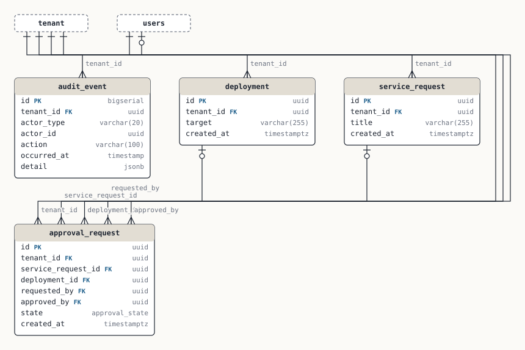

# Approvals & audit

Service requests and deployments that need sign-off, and the append-only audit trail.

Tenant-scoped: yes

## Relationships

- `service_request.tenant_id` → `tenant.id` — one tenant, many service_request · required · ON DELETE CASCADE · indexed  
  why: not documented
- `deployment.tenant_id` → `tenant.id` — one tenant, many deployment · required · ON DELETE CASCADE · indexed  
  why: not documented
- `approval_request.tenant_id` → `tenant.id` — one tenant, many approval_request · required · ON DELETE CASCADE · indexed  
  why: not documented
- `approval_request.service_request_id` → `service_request.id` — one service_request, many approval_request · optional · ON DELETE NO ACTION · not indexed  
  why: not documented
- `approval_request.deployment_id` → `deployment.id` — one deployment, many approval_request · optional · ON DELETE NO ACTION · not indexed  
  why: not documented
- `approval_request.requested_by` → `users.id` — one users, many approval_request · required · ON DELETE NO ACTION · indexed  
  why: not documented
- `approval_request.approved_by` → `users.id` — one users, many approval_request · optional · ON DELETE NO ACTION · not indexed  
  why: not documented
- `audit_event.tenant_id` → `tenant.id` — one tenant, many audit_event · required · ON DELETE NO ACTION · indexed  
  why: not documented

## service_request

| Column | Type | Null | Default | References | Notes |
|---|---|---|---|---|---|
| `id` (PK) | uuid | NOT NULL | gen_random_uuid() |  |  |
| `tenant_id` | uuid | NOT NULL |  | tenant.id |  |
| `title` | varchar(255) | NOT NULL |  |  |  |
| `created_at` | timestamptz | NOT NULL | now() |  |  |

Indexes: (tenant_id)  
Referenced by: approval_request  
RLS: enabled, policies: service_request_tenant_isolation

## deployment

| Column | Type | Null | Default | References | Notes |
|---|---|---|---|---|---|
| `id` (PK) | uuid | NOT NULL | gen_random_uuid() |  |  |
| `tenant_id` | uuid | NOT NULL |  | tenant.id |  |
| `target` | varchar(255) | NOT NULL |  |  |  |
| `created_at` | timestamptz | NOT NULL | now() |  |  |

Indexes: (tenant_id)  
Referenced by: approval_request  
RLS: enabled, policies: deployment_tenant_isolation

## approval_request

An approval is for EITHER a service request OR a deployment.

| Column | Type | Null | Default | References | Notes |
|---|---|---|---|---|---|
| `id` (PK) | uuid | NOT NULL | gen_random_uuid() |  |  |
| `tenant_id` | uuid | NOT NULL |  | tenant.id |  |
| `service_request_id` | uuid |  |  | service_request.id |  |
| `deployment_id` | uuid |  |  | deployment.id |  |
| `requested_by` | uuid | NOT NULL |  | users.id |  |
| `approved_by` | uuid |  |  | users.id |  |
| `state` | approval_state | NOT NULL | 'pending' |  |  |
| `created_at` | timestamptz | NOT NULL | now() |  |  |

Indexes: (tenant_id); (requested_by)  
Referenced by: nothing  
RLS: enabled, policies: approval_request_tenant_isolation

Findings:

- **Warning** Foreign key without index — PostgreSQL does not index FK columns automatically. Every DELETE/UPDATE on `service_request` must scan `approval_request` to check the constraint, and every join from the parent side is a sequential scan.
- **Warning** Foreign key without index — PostgreSQL does not index FK columns automatically. Every DELETE/UPDATE on `deployment` must scan `approval_request` to check the constraint, and every join from the parent side is a sequential scan.
- **Warning** Foreign key without index — PostgreSQL does not index FK columns automatically. Every DELETE/UPDATE on `users` must scan `approval_request` to check the constraint, and every join from the parent side is a sequential scan.
- **Note** Nullable foreign key — `approval_request.approved_by` may be NULL, so the relationship to `users` is optional. That is legitimate (e.g. approved_by before approval) but often a modelling shrug: a row with no owner, or two nullable FKs that are secretly an either/or.
- **Warning** Either/or foreign keys without a CHECK — `approval_request` has several nullable FKs (service_request_id, deployment_id) that look like an exclusive arc — a row should point at exactly one of them. Nothing stops zero or both.

## audit_event

Append-only audit trail. actor may be a user or a system job. Append-only. Never UPDATE or DELETE rows here.

| Column | Type | Null | Default | References | Notes |
|---|---|---|---|---|---|
| `id` (PK) | bigserial | NOT NULL |  |  |  |
| `tenant_id` | uuid | NOT NULL |  | tenant.id |  |
| `actor_type` | varchar(20) | NOT NULL |  |  | user \| system |
| `actor_id` | uuid |  |  |  |  |
| `action` | varchar(100) | NOT NULL |  |  |  |
| `occurred_at` | timestamp | NOT NULL | now() |  |  |
| `detail` | jsonb |  |  |  |  |

Indexes: (tenant_id, occurred_at)  
Referenced by: nothing  
RLS: enabled, policies: audit_event_tenant_isolation

Findings:

- **Note** Tenant FK relies on the default ON DELETE NO ACTION — Deleting a `tenant` row will fail while `audit_event` rows exist. Fine if tenants are never hard-deleted; a surprise the day offboarding/GDPR erasure is built.
- **Warning** Enum-like column with no CHECK — `actor_type` is a short string that clearly takes a fixed set of values, but the database accepts anything. Typos become new states, and nobody can list the legal values without reading application code. The comment lists `user | system`, i.e. the values are known.
- **Warning** Polymorphic reference without referential integrity — `actor_id` points at different tables depending on `actor_type`. No FK can express that, so orphans accumulate silently and every join needs a CASE. Acceptable for append-only audit data; painful anywhere the target must still exist.
- **Note** TIMESTAMP without time zone — `occurred_at` stores wall-clock time with no zone. It reads back differently depending on the session's TimeZone, and DST transitions produce ambiguous values.

