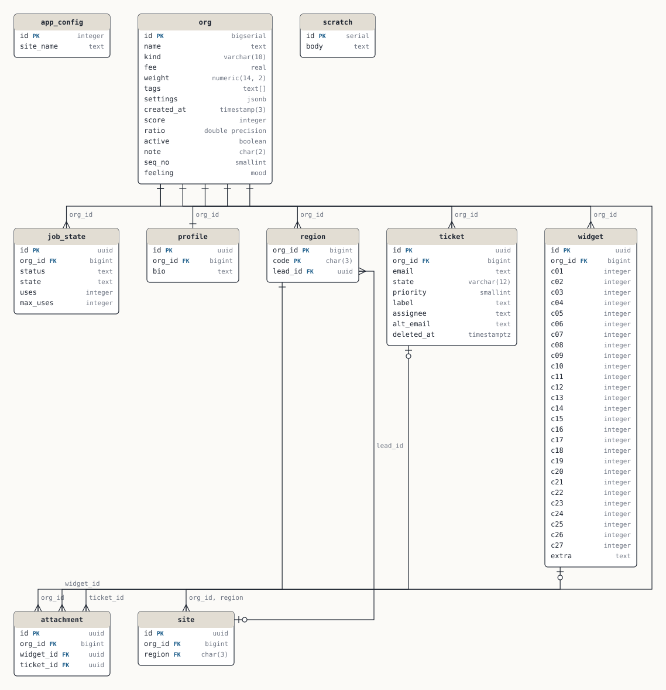

# Edge cases

Every construct the sample schema lacks, so the port is exercised on real parser output.

10 tables · 76 columns · 10 foreign keys · 9 errors · 8 warnings · 11 notes

See [FINDINGS.md](FINDINGS.md) for the design review.

## Conventions

- The tenant column is org_id.

## Domains

| Domain | Tables | Findings |
|---|---|---|
| [Core](domains/core.md) | 4 | 4 |
| [Work](domains/work.md) | 7 | 23 |

## Diagram

